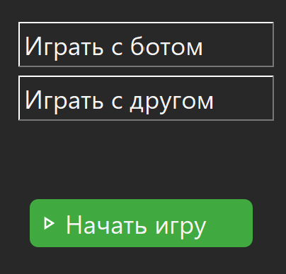
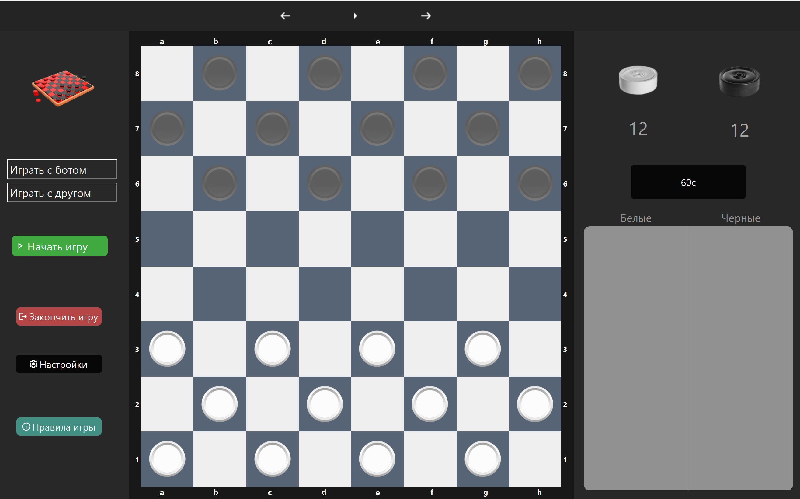

<h1>Игра в шашки</h1>

<h2>Возможности игры<h2>

- Играть с другом локально на одном устройстве

- Играть против бота

#### У бота есть три уровня сложности: **легкий**, **средний**, **профессионал**.

Бот реализован с помощью алгоритма минимакс с альфа-бета отсечениями.

### При запуске приложения пользователя встречает приветсвенно окно.

### Главный экран приложения выглядит так ###

### В данной реализации шашек ипользуются правила русских шашек с ним пользователь может ознакомиться нажав на клавишу "**Правила игры**".

### Когда пользователь может сбить вражескую шашку, поле подсвечивается красным цветом, после выбора шашки, которой можно совершить взятие, пользователю подсвечиваются поля, куда он может стать после сбития.

Так это выглядит для дамки

## После победы одного из игроков появляется новое окно, в котором можно продолжить играть или вернуться к начальному окну.

 В правой части приложения во время игры ведется статистика.

В приложениии можно выбрать несколько различных цветовых тем 

 
 
 
 

В приложении можно настроить музыку

 

